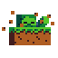

<h1 align="center">
   
  Spawn Animations
</h1>

  
  
  
  

> A data pack/mod for Minecraft 1.14x-1.21x

## Features

Hostile mobs dig out of the ground or poof into existence when they spawn.

**Works with:**
Zombies, Husks, Drowned, Skeletons, Strays, Spiders, Cave Spiders, Creepers, Slimes, Magma Cubes, Wither Skeletons, Hoglins, Zombified Piglins, Striders, Enderman and Giants.

This data pack/mod is designed to be as unintrusive as possible. Hidden entities including their worn armor and tools will only be invisible and silent.

This data pack/mod is completely server-side, but can also be installed on the client for singleplayer worlds!

[➜ For available settings and customization, take a look at the wiki](https://github.com/Tschipcraft/spawnanimations/wiki)

More sophisticated animations with Animated Java are planned for v2.0.

## Demo Gifs

Click to expand

## Installation

Download the latest release from [here](https://github.com/Tschipcraft/spawnanimations/releases/latest) and put the data pack .zip file into the `datapacks` folder of your Minecraft world.

For Minecraft 1.14, 1.15 and 1.16 use [a legacy edition](https://github.com/Tschipcraft/spawnanimations/tree/master/other_editions).

This data pack is also available as a mod with an additional global config file and settings menu when installed alongside [MidnightLib](https://modrinth.com/mod/midnightlib). Download the latest release and put the mod .jar file into your `.minecraft/mods` folder.

Also available on Modrinth and CurseForge!

<a href="https://modrinth.com/datapack/spawn-animations">
<picture>
  <source height="72px" media="(prefers-color-scheme: dark)" srcset="https://raw.githubusercontent.com/Tschipcraft/badges/main/assets/modrinth-badge-dark.svg">
  <source height="72px" media="(prefers-color-scheme: light)" srcset="https://raw.githubusercontent.com/Tschipcraft/badges/main/assets/modrinth-badge-light.svg">
  
</picture>
</a>
<a href="https://www.curseforge.com/minecraft/texture-packs/spawn-animations">
<picture>
  <source height="72px" media="(prefers-color-scheme: dark)" srcset="https://raw.githubusercontent.com/Tschipcraft/badges/main/assets/curseforge-badge-dark.svg">
  <source height="72px" media="(prefers-color-scheme: light)" srcset="https://raw.githubusercontent.com/Tschipcraft/badges/main/assets/curseforge-badge-light.svg">
  
</picture>
</a>

## Manage

To open the ingame menu, execute `/trigger tschipcraft.menu` or `/function #tschipcraft:menu`. There is a **Reset** and an **Uninstall** button.
